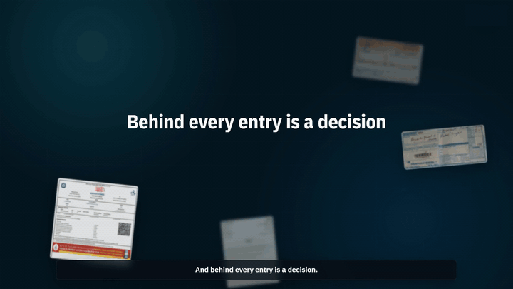
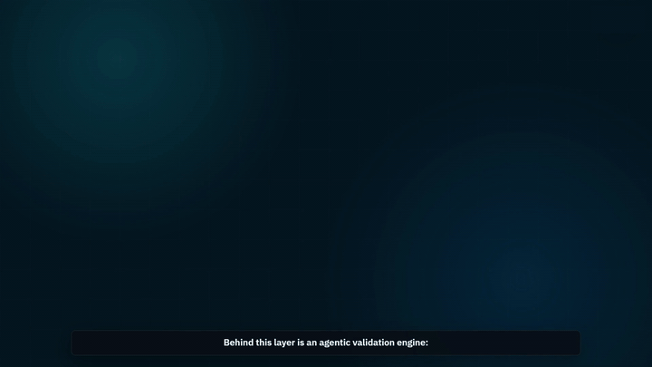
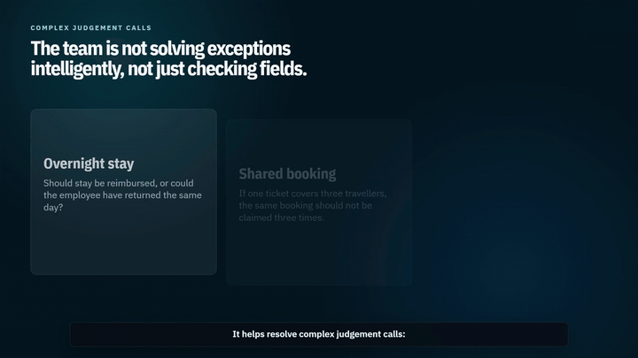

# SaaS Motion Graphics Playbook

A reusable playbook for creating polished product-launch and transformation videos using structured storytelling, motion references, screenshots, voiceover, captions, and programmable motion graphics.

## Preview The Output

These short GIFs show the type of motion system this playbook helps you plan, build, review, and package.

| Opening title | Decision constellation |
| --- | --- |
|  |  |

| Agentic engine | Judgement cards |
| --- | --- |
|  |  |

## What This Repo Teaches

This repo outlines a reusable motion-graphics production process for moving from a rough business story to a polished launch-style film using:

- an AI-assisted planning workflow for research, planning, and prompt iteration
- HyperFrames as the main motion-graphics production surface
- optional Remotion inserts for isolated animation-heavy scenes or previs
- screenshots, mockups, UI fragments, and voiceover-driven timing
- FFmpeg for snippet creation, preview assets, and delivery support

The structure is intentionally generic. You can adapt the same method to many stories:

- business pain point
- product workflow
- role of AI
- user journey
- operational impact
- final positioning or callout

## Final Output You Can Expect

By following this playbook, you can produce a portfolio-quality film such as:

- a SaaS launch explainer
- an internal transformation film
- an AI feature reveal
- a workflow modernization showcase
- a leadership-ready product narrative

Typical output:

- `1920x1080`
- `30fps`
- `90-150 seconds`
- voiceover-led with captions
- premium UI motion graphics
- reusable scene system for future launches

## Repo Map

| Folder | Purpose |
| --- | --- |
| [`docs/`](docs) | End-to-end production method, architecture, prompting, public release checks, and lessons learned |
| [`prompts/`](prompts) | Reusable prompts for strategy, visuals, build, sync, QA, and snippets |
| [`storyboard/`](storyboard) | Reference script, timestamped storyboard, visual plan, and voiceover/caption map |
| [`templates/`](templates) | Copy-paste templates for scripts, direction, asset planning, and QA |
| [`starter-kit/`](starter-kit) | Lightweight generic HyperFrames starter patterns inspired by the original production |
| [`examples/`](examples) | Example of adapting the workflow to a different product story |
| [`media/`](media) | Public-safe snippets, GIF/thumbnail preview, and README-safe assets |

## Visual Style Snapshot

This playbook leans toward a premium enterprise style:

- dark command-room backgrounds
- restrained cyan/blue intelligence accents
- cinematic pans, table reveals, and modal focus moments
- a mix of real screenshots and intentionally designed explainer inserts
- references translated from web templates into custom HyperFrames scenes

## Included Media

The public media set is curated to be safe for sharing:

- logo areas are hidden or avoided
- company-specific names are excluded from documentation
- snippets focus on animation patterns, not private interface context

Start here:

- [Preview GIF](media/preview.gif)
- [Opening title GIF](media/gifs/01-opening-title.gif)
- [Decision constellation GIF](media/gifs/02-decision-constellation.gif)
- [Agentic engine GIF](media/gifs/03-agentic-engine.gif)
- [Judgement cards GIF](media/gifs/04-judgement-cards.gif)
- [Opening snippet](media/snippet-01-opening-title.mp4)
- [Decision constellation snippet](media/snippet-02-decision-constellation.mp4)
- [Agentic engine snippet](media/snippet-03-agentic-engine.mp4)
- [Judgement cards snippet](media/snippet-04-judgement-cards.mp4)
- [Impact/KPI snippet](media/snippet-05-impact-kpis.mp4)

## Important Notes

- This repo documents an AI-assisted planning and motion-graphics workflow built around programmable scenes, voiceover timing, and reusable visual patterns.
- Remotion is treated here as optional support tooling, not the required primary renderer.
- Some production details are inferred from working files and production notes. Where that happens, the docs frame them as guidance to adapt to your own toolchain.

## Quick Start

1. Read [CASE_STUDY.md](CASE_STUDY.md).
2. Read [docs/production_pipeline.md](docs/production_pipeline.md).
3. Skim [docs/workflow_architecture.md](docs/workflow_architecture.md).
4. Read [docs/reference_translation.md](docs/reference_translation.md) to see how website/template references become custom scenes.
5. Reuse the prompts in [`prompts/`](prompts).
6. Clone the templates in [`templates/`](templates).
7. Use the starter patterns in [`starter-kit/hyperframes/`](starter-kit/hyperframes).

## Portfolio-Friendly Positioning

If you want to publish your own version, position it as:

`AI-assisted motion graphics workflow for product launches and business transformation storytelling`

That keeps the repo broad, useful, and easy to repurpose.
